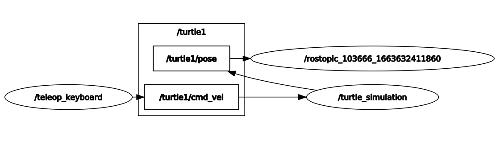
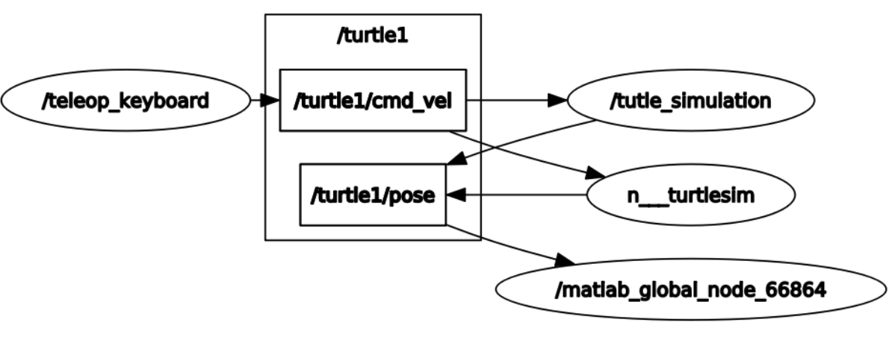
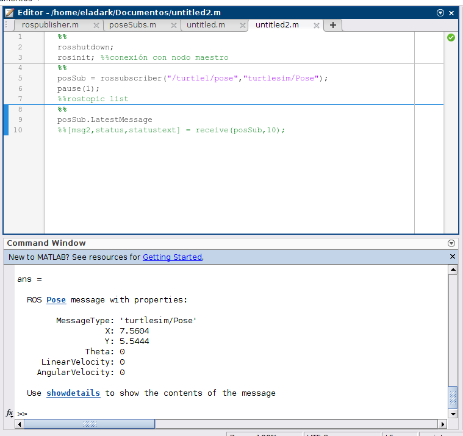

# ROS – Introduction

Introduction to the main *[ROS Graph Concepts](http://wiki.ros.org/ROS/Concepts)* (nodes, topics, services, publishers, and subscribers) using the classic [turtlesim package](http://wiki.ros.org/turtlesim), with both Python and [MATLAB ROS Toolbox](https://www.mathworks.com/help/ros/ug/get-started-with-ros.html) implementations.

---
## How to Use the Package

The first thing to do is to clone this repository (inside your catkin workspace) and build the package for ROS:

```
git clone https://github.com/Canborda/robotics-ROS-1-Introduction.git
catkin build robotics-ros-1-introduction
source devel/setup.bash
```

Now just launch the package with the following command:
```
roslaunch robotics-ros-1-introduction turtle.launch
```
And that's it! Now you should have running two nodes:
- `/turtle_simulation`: visualization of the __turtlesim__ package.
- `/teleop_keyboard`: node that publishes the linear and angular velocity or teleports to the __turtlesim__ topics, when the corresponding keys are pressed.


---
## The Turtlesim Package

ROS noetic has a built-in demo package called [turtlesim](http://wiki.ros.org/turtlesim) that starts a node with a visualization window and is subscribed to different topics in order to move the turtle on it.

The topics used for this package were:
- `/turtle1/cmd_vel`: to control the linear and angular velocity.
- `/turtle1/pose`: to monitor turtle's position.

Also we used two services:
- `/turtle1/teleport_absolute`: to re-spawn the turtle on the initial point.
- `/turtle1/teleport_relative`: to rotate the turtle 180 degrees with respect to its current position.


---
## ROS on Python

The presented solution uses the keyboard listener of the [pynput library](https://pynput.readthedocs.io/en/latest/keyboard.html#monitoring-the-keyboard) to listen for the keys: `W`, `A`, `S`, `D`, `R` and `Space`, and depending on the pressed key publishes a message on the corresponding topic.

- For linear velocity `W`/`S` keys increase or decrease the value with a rate of 1, and the limit value is 10 (forward or backward).
- For angular velocity `A`/`D` keys increase or decrease the value with a rate of 1, and the limit value is 10 (clockwise or counterclockwise).

When the `/teleop_keyboard` node is publishing messages, the ROS graph looks like this (the node with the long name is a temporary node created with the `rostopic echo /turtle1/pose` command to monitor the turtle pose):

<p align="center"></p>

### Demonstration
https://user-images.githubusercontent.com/55401093/191138347-6409a2b8-c60f-417a-9f12-91d48614543e.mp4

---
## ROS on Matlab

The [Matlab ROS Toolbox](https://www.mathworks.com/help/ros/ug/get-started-with-ros.html) allows using ROS in a simpler (less code) way while leveraging all Matlab tools. For this we developed two scripts:
- [rospublisher](./matlab_script/rospublisher.m) is a simple publisher that shows how to send a message to a ROS topic from Matlab.
- [poseSubs](./matlab_script/poseSubs.m) is a simple subscriber that also plots the turtle position in a matlab figure.

In this alternative Matlab creates its own node to communicate with all other ROS running nodes, then the resulting graph looks like this:

<p align="center"></p>

From Matlab it is also possible to `echo` a topic in order to read its messages:
<p align="center"></p>

---
## Conclusions

- The main advantage of using ROS is the communication between different software and hardware devices with an integrated environment, thus it is easier to build more complex robotics systems on a wide variety of applications. 

- ROS is an open source tool, so it comes up with a huge community and online support, where it keeps growing and solving more issues. It is also well documented.

- Matlab connection with ROS can simplify some processes and allows using any Matlab tool, however it is important to mention that Matlab is not free software and sometimes users may not fully understand what is really happening in the system.

---
