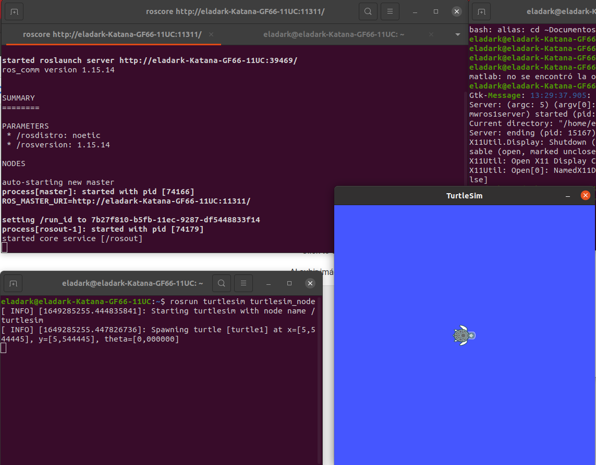
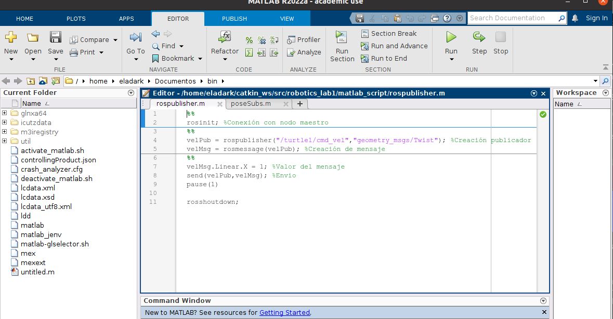
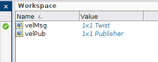
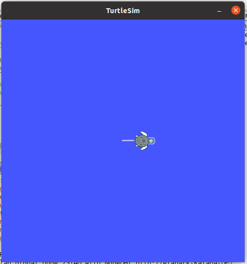
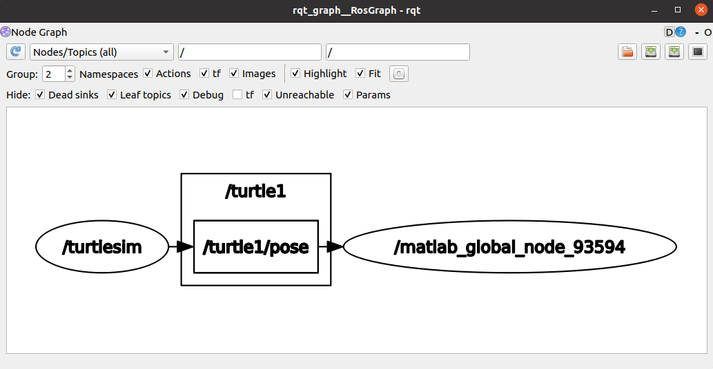

## robotics-ROS-1-Introduction
# INTRODUCTION TO ROS

This repository presents a friendly introduction to ROS and the usage of the main *[ROS Graph Concepts](http://wiki.ros.org/ROS/Concepts)* like nodes, topics, services, pusblishers and subscribers; based on the classic [turtlesim package](http://wiki.ros.org/turtlesim). We also present the basics of ROS connection with the [MATLAB ROS Toolbox](https://www.mathworks.com/help/ros/ug/get-started-with-ros.html) as an alternative to connect and use all the ROS features.

> ## Contributors
> 
> - [Camilo Andrés Borda Gil](https://github.com/Canborda) (caabordagi@unal.edu.co)
> - [Brian Camilo Saiz Cavanzo](https://github.com/briansaiz) (brcsaizca@unal.edu.co)

---
## How to Use the Package

The first thing to do is to clone this repository (inside your catkin workspace) and build the package for ROS:

```
git clone https://github.com/Canborda/robotics-ROS-1-Introduction.git
catkin build robotics-ros-1-introduction
source devel/setup.bash
```

Now just launch the package with the following command:
```
roslaunch robotics-ros-1-introduction turtle.launch
```
And that's it ! now you should have running two nodes:
- `/turtle_simulation`: visualization of the __tustlesim__ package.
- `/teleop_keyboard`: node that publishes the linear and angular velocity or teleports to the __turtlesim__ topics, when the corresponding keys are pressed.


---
# The Turtlesim Package

ROS noetic has a builted-in demo package called [turtlesim](http://wiki.ros.org/turtlesim) that starts a node with a visualization window and is subscribed to a different topics in order to move the turtle on it.

The topics used for this package were:
- `/turtle1/cmd_vel`: to control the linear and angular velocity.
- `/turtle1/pose`: to monitor turtle's position.

Also we used two services:
- `/turtle1/teleport_absolute`: to re-spawn the turtle on the initial point.
- `/turtle1/teleport_relative`: to rotate the turtle 180 degrees with respect to its current position.


---
# ROS on Python

The presented solution uses the keyboard listener of the [pynput library](https://pynput.readthedocs.io/en/latest/keyboard.html#monitoring-the-keyboard) to listen for the keys: `W`, `A`, `S`, `D`, `R` and `Space`, and depending on the pressed key publishes a message on the corresponding topic.

- For linear velocity `W`/`S` keys increase or decrease the value with a rate of 1, and the limit value is 10 (forward or backward).
- For angular velicity `A`/`D` keys increase or decrease the value with a rate of 1, and the limit value is 10 (clockwise or counterclockwise).

### Demostration
https://user-images.githubusercontent.com/55401093/191137875-15a3ff69-3865-4207-b675-7f48ea83b848.mp4


## Conexión Ros con Matlab

- Con Linux operando lanzar 2 terminales. En la primera terminal escribir el comando roscore
para iniciar el nodo maestro, en la segunda terminal escribir rosrun turtlesim turtlesim node, en este momento aparece la Tortuga tal y como se muestra en la siguiente imagen.



A continuación se procede a lanzar una instancia de Matlab y se creo el script poseSub.m.




Al correr la primera sección nos hemos conectado al modo maestro de ROS, lo cual queda evidenciado con el siguiente mensaje en command Window de Matlab.

```
The value of the ROS_MASTER_URI environment variable, http://localhost:11311, will be used to connect to the ROS master.
Initializing global node /matlab_global_node_73140 with NodeURI http://eladark-Katana-GF66-11UC:39157/ and MasterURI http://localhost:11311.
```
Tras correr la segunda sección se puede apreciar la creación del Publisher y el Message, de la siguiente manera. 



Para finalizar se ejecuta la tercera y ultima sección del script, la cual activa el nodo Publisher, el cual envia el mensaje de velocidad lineal en x = 1, al topico /turtle1/cmd_vel, generando el siguiente comportamiento en nuestra tortuga. 




- A continuación se crea un script en Matlab llamado poseSubs.m, que permite suscribirse al tópico de pose de la simulación de turtle1.


A modo de verificación se ejecuta el comando rqt_graph en la terminal, donde se obtiene el siguente grafico, el cual nos muestra como el nodo publica al topico /turtle1/pose, un tipo Pose, simultaneamente el nodo creado por matlab se suscribe al mismo topico para recibir el mensaje.



sin embargo, mas adelante se puede apreciar que el script poseSub.m es alterado buscando nuevas funcionalidades.

- Ahora se busca Crear un script en Matlab que permita enviar todos los valores asociados a la pose de turtle1.

- Consultando la manera en qué se finaliza el nodo maestro en Matlab se halló que esta acción se realiza mediante el comando:

```matlab
rosshutdown;
```
Esto es necesario por que matlab solo puede tener un nodo instanciado a la vez.


## Conclusiones:

- La principal ventaja de ROS se encuentra en permite una amplia integración entre diferentes sistemas y aplicaciones, lo que permite formar elaborados mecanismos roboticos con amplia variedad de ocupaciones. 

- Ros al ser un framework de codigo abierto se convierte de una gran comunidad de desarrolladores, que a tambien nutren el sistema con una gran variedad de librerias y repositorios no oficiales.

- Ros cuenta con una amplia documentación que permite desembolverse practicamente ante cualquier problema.
