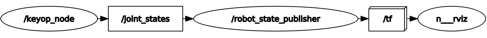
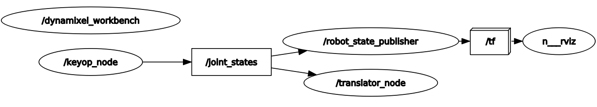
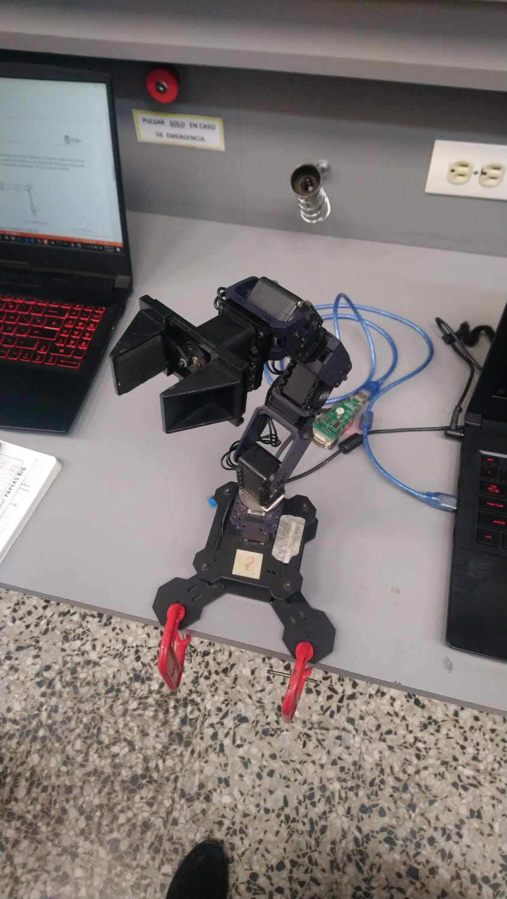
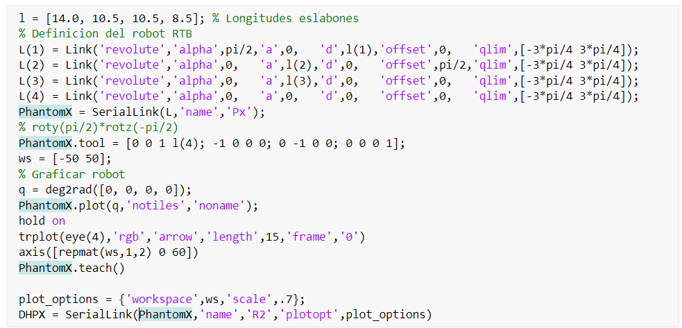
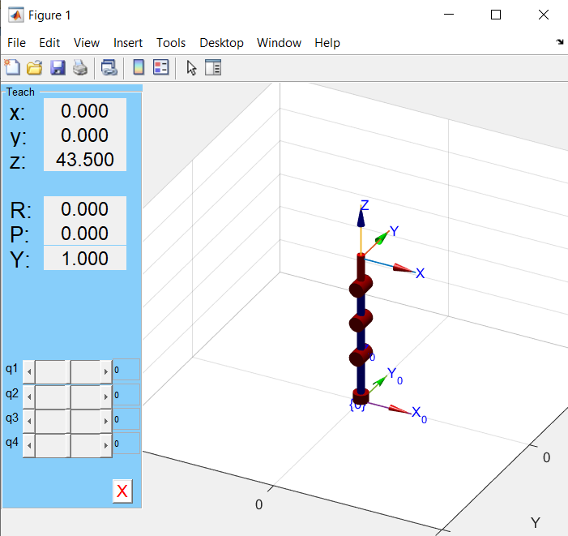
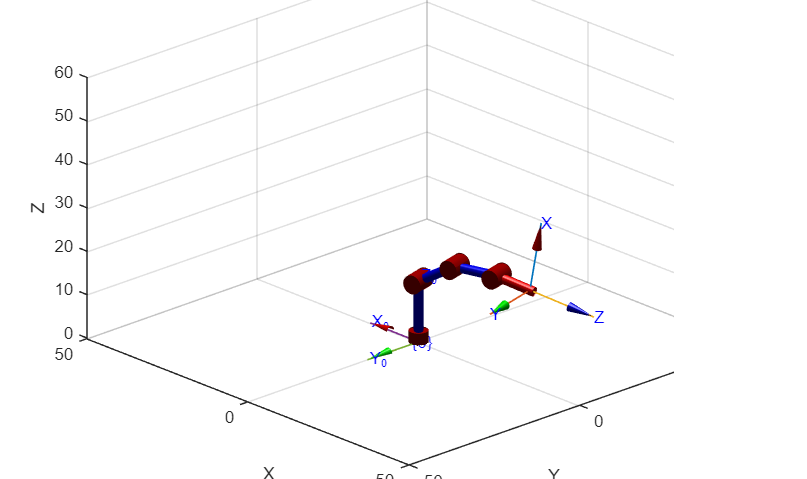
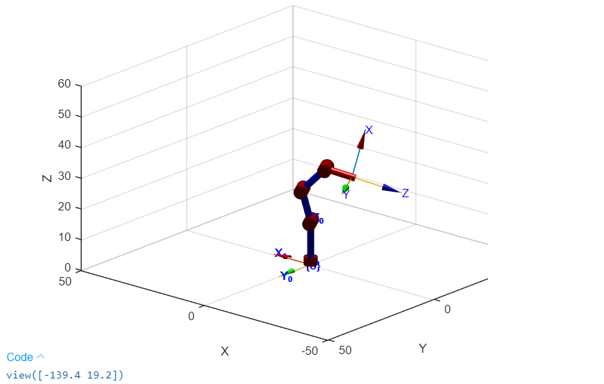

# ROS – PhantomX Forward Kinematics

Keyboard teleoperation of a PhantomX Pincher robot using ROS, with forward kinematics modeled via DH parameters. Supports both real-robot controller mode and Rviz simulation mode.

---
## How to Use the Package

The first thing to do is to clone this repository (inside your catkin workspace) and build the package for ROS:

```
git clone https://github.com/Canborda/robotics-ros-2-phantomx-forward_kinematics.git
catkin build robotics-ros-2-phantomx-forward_kinematics
source devel/setup.bash
```

Make sure you have those python libraries installed (we use them for the `keyop_node`):

- [Py console](https://pypi.org/project/py-console/)
- [Pynput](https://pypi.org/project/pynput/)

To launch the package you have two modes: you can test it with a real [PhantomX Robot Arm](https://www.trossenrobotics.com/p/PhantomX-Pincher-Robot-Arm.aspx) in the **controller mode** or just visualize the robot in Rviz in the **simulation mode**.

<br>

### Simulation Mode

<br>

```
roslaunch robotics-ros-2-phantomx-forward_kinematics px_rviz_keyop.launch
```

For this mode you won't need anything additional to this package! It will start the Rviz interface with a model of the _PhantomX robot_ and a cli to control the different joints position.

This command will start the `keyop_node` which publishes a message of type [sensor_msgs/JointState Message](http://docs.ros.org/en/melodic/api/sensor_msgs/html/msg/JointState.html) via a topic called `/joint_states`; and the `robot_state_publisher` node which is subscribed to the same topic and process all info to update the robot pose in Rviz. This is the **rqt_graph** for the simulation mode:
<p align="center"></p>

#### Demonstration
https://github.com/Canborda/robotics-ROS-2-PhantomX-forward_kinematics/assets/55401093/8849acc1-fdd9-45cb-8839-ffa4ed3ad2b4

<br>

### Controller Mode

<br>

```
roslaunch robotics-ros-2-phantomx-forward_kinematics px_controllers.launch
```

This command will start several nodes:

- The `dynamixel_workbench` node allows the communication between ROS and the robot.
- The `keyop_node` starts a pretty cli so you can select a joint to move or change between five predefined positions (same node as in simulation mode).
- The `translator_node` just receives all the joints position in radians from the keyop node, and maps them into the bit-level units for the dynamixel package.
- The `rviz` node for **real time visualization** of your robot configuration.

The **rqt_graph** for the controller mode is the following:
<p align="center"></p>

#### Demonstration
https://github.com/Canborda/robotics-ROS-2-PhantomX-forward_kinematics/assets/55401093/40f4864a-cd97-4052-b25b-a71fba0bcf25

---
## Robot Setup



Measure the link lengths for each joint of the PhantomX Pincher robot using a caliper. The link length is defined as the minimum distance connecting two consecutive joints.

Obtain the standard DH parameters of the PhantomX Pincher from the measured dimensions:

|     | ai  | alpha | di  | Theta | off  |
| --- | --- | ----- | --- | ----- | ---- |
| 1   | 0   | Pi/2  | l1  | q1    | 0    |
| 2   | l2  | 0     | 0   | q2    | Pi/2 |
| 3   | l3  | 0     | 0   | q3    | 0    |
| 4   | l4  | 0     | 0   | q4    | 0    |

With measured link lengths:

|     | length (mm) |
| --- | ----------- |
| l1  | 140         |
| l2  | 105         |
| l3  | 105         |
| l4  | 85          |

---
## Toolbox



```

DHPX =

R2 (4 axis, RRRR, stdDH, fastRNE)

+---+-----------+-----------+-----------+-----------+-----------+
| j |     theta |         d |         a |     alpha |    offset |
+---+-----------+-----------+-----------+-----------+-----------+
|  1|         q1|         14|          0|      1.571|          0|
|  2|         q2|          0|       10.5|          0|      1.571|
|  3|         q3|          0|       10.5|          0|          0|
|  4|         q4|          0|          0|          0|          0|
+---+-----------+-----------+-----------+-----------+-----------+

grav =    0  base = 1  0  0  0   tool =   0           0           1         8.5
          0         0  1  0  0           -1           0           0           0
       9.81         0  0  1  0            0          -1           0           0
                    0  0  0  1            0           0           0           1

```

q = [0, 0, 0, 0]



q = [15, 60, 30, 10]



q = [30, -15, 60, 60]



---
