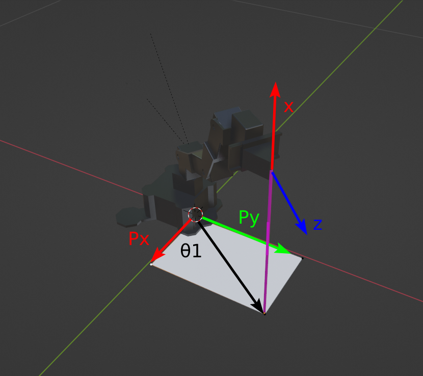
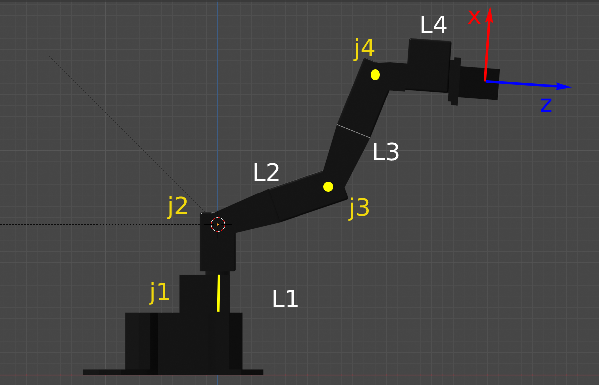
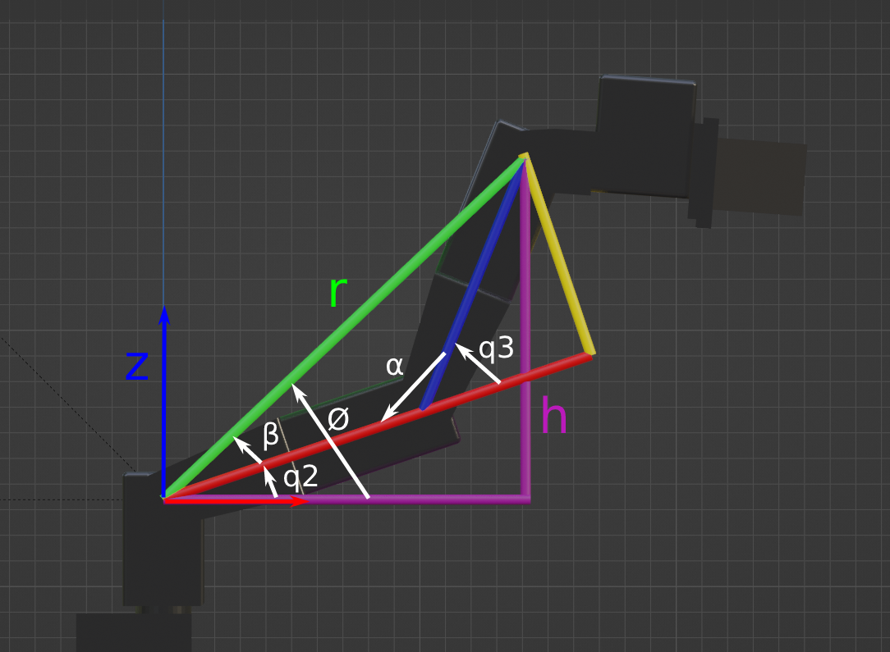
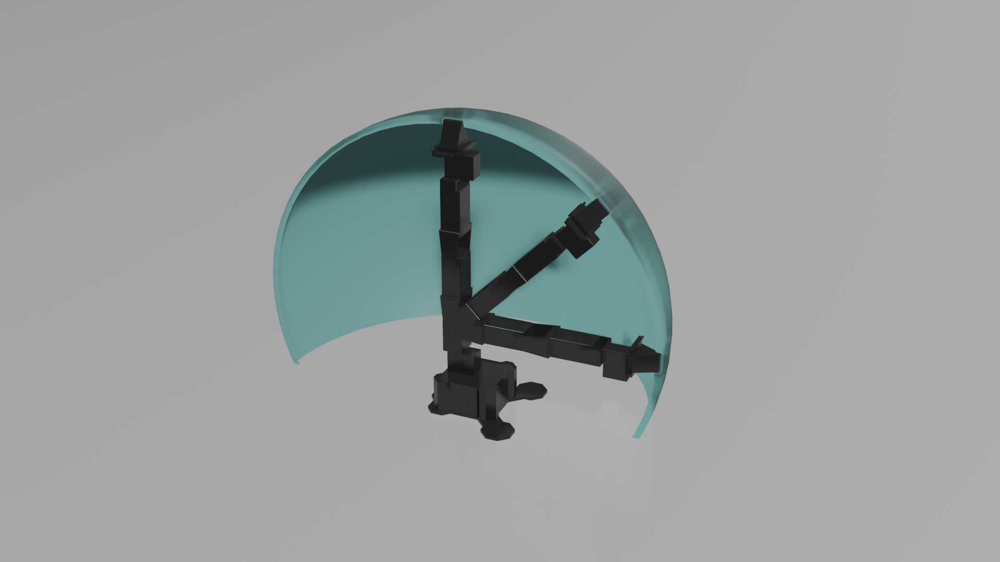

# ROS – PhantomX Inverse Kinematics

Pick and place operation with a PhantomX Pincher robot using ROS and a geometric inverse kinematics model. Supports both real-robot controller mode and Rviz simulation mode.

---
## How to Use the Package

Clone this repository (inside your catkin workspace) and build the package for ROS:

```
git clone https://github.com/Canborda/robotics-labs.git
catkin build robotics-ros-3-phantomx-inverse_kinematics
source devel/setup.bash
```

Launch the package in **simulation mode** (Rviz only):

```
roslaunch robotics-ros-3-phantomx-inverse_kinematics px_rviz.launch
```

Launch the package in **controller mode** (real robot):

```
roslaunch robotics-ros-3-phantomx-inverse_kinematics px_controllers.launch
```

---
## Inverse Kinematics

The inverse kinematic model of a robot is a method that allows finding the joint positions from the desired position and orientation of the end-effector. The geometric method is used for the PhantomX, deriving a closed-form function for each of the four joints based on the different configurations the robot can adopt.

### Joint 1
This joint is the simplest to compute. Given the end-effector position, its X and Y coordinates yield:



```
θ1 = atan(py / px)
```

### Wrist Decoupling

To simplify the system, kinematic decoupling is applied. The wrist position (joint 4) is computed from the end-effector homogeneous transformation matrix (HTM):

$T=\left\lbrack \begin{array}{cccc}
\mathrm{xx} & \mathrm{yx} & \mathrm{zx} & p_x \\
\mathrm{xy} & \mathrm{yy} & \mathrm{zy} & p_y \\
\mathrm{xz} & \mathrm{yz} & \mathrm{zz} & p_z \\
0 & 0 & 0 & 1
\end{array}\right\rbrack$

The wrist position `w` is found as:

$w=\left\lbrack \begin{array}{c}
p_x \\
p_y \\
p_z 
\end{array}\right\rbrack -\mathrm{L4}\left\lbrack \begin{array}{c}
\mathrm{zx}\\
\mathrm{zy}\\
\mathrm{zz}
\end{array}\right\rbrack =\left\lbrack \begin{array}{c}
\mathrm{wx}\\
\mathrm{wy}\\
\mathrm{wz}
\end{array}\right\rbrack$



With the wrist coordinates known, q2 and q3 can be solved.

### Joints 2 and 3

This reduces to a planar trigonometric problem as shown in the figure below:



q3 is obtained using the law of cosines:

$\Theta 3=\mathrm{acos}\left(\frac{{\mathrm{wx}}^2 +{\mathrm{wz}}^2 -{\mathrm{L2}}^2 -{\mathrm{L3}}^2 }{2*\mathrm{L2}*\mathrm{L3}}\right)$

q2 is found by subtracting angle β from angle Φ:

$\Theta 2=\mathrm{atan}\left(\frac{\mathrm{wz}}{\mathrm{wx}}\right)-\mathrm{atan}\left(\frac{\mathrm{L3}*\sin \left(\Theta 3\right)}{\mathrm{L2}+\mathrm{L3}*\cos \left(\Theta 3\right)}\right)$

### Joint 4

Finally, q4 is obtained as:

$\Theta 4=\omega -\Theta 2-\Theta 3$

where ω is the desired end-effector orientation.

---
## Workspace

The workspace of the PhantomX robot is shown below.



---
## Demonstration

  
[Watch full video here](https://youtu.be/Qg1i_FicRYc)

---
